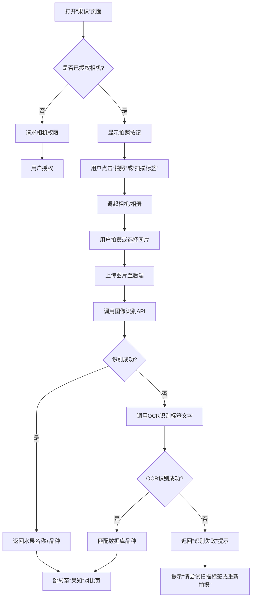
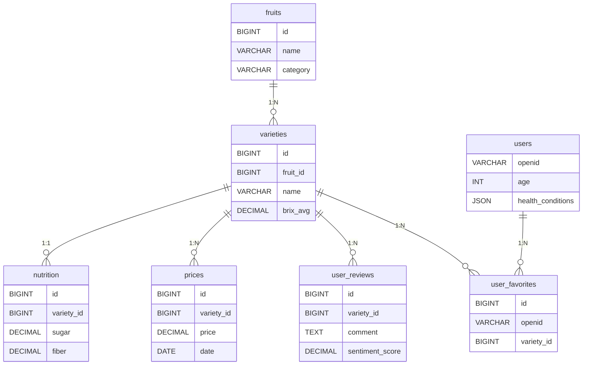

# 🍉 果识通（FruitMind）微信小程序 PRD 文档

> 一个基于图像识别与个性化推荐的智能水果选购助手

---

## 📄 文档信息

| 项目 | 内容 |
|------|------|
| 产品名称 | 果识通（FruitMind） |
| 产品类型 | 微信小程序 |
| 版本号 | v1.0 |
| 撰写人 | [你的名字] - 资深产品经理 |
| 所属部门 | 智能健康产品部 |
| 编写日期 | 2025年4月5日 |
| 审核人 | 技术负责人、UX设计师、数据负责人、法务合规 |
| 状态 | 已评审 / 待开发 |
| 关联文档 | 接口文档、UI设计稿、数据字典、测试用例 |

---

## 一、文档目的

本文档旨在全面定义“果识通”微信小程序的产品需求，涵盖功能设计、交互逻辑、数据架构、技术实现、非功能性要求及项目管理细节，作为产品、设计、研发、测试、运营团队的**唯一权威依据**，确保项目高效推进与高质量交付。

---

## 二、产品背景与目标

### 2.1 背景

现代消费者在选购水果时面临四大核心痛点：
1. **识别难**：品种外观相似（如麒麟瓜 vs 黑美人），标签信息不清晰
2. **信息差**：缺乏权威的营养、糖度、价格对比数据
3. **健康适配难**：糖尿病、高血压等人群难以判断是否适合食用
4. **口感主观**：依赖个人经验，缺乏结构化评价体系

### 2.2 产品目标

| 目标 | 说明 |
|------|------|
| ✅ 快速识别 | 支持拍照+标签扫描，3秒内返回品种 |
| ✅ 多维对比 | 营养、价格、糖度、口感四维可视化对比 |
| ✅ 个性推荐 | 基于健康数据与偏好，输出Top5推荐 |
| ✅ 数据可信 | 所有数据标注来源，支持溯源 |
| ✅ 用户友好 | 界面简洁，操作流畅，支持离线缓存 |

---

## 三、用户画像

| 用户类型 | 特征 | 核心诉求 | 使用频率 | 使用场景 |
|----------|------|----------|----------|----------|
| 健康关注者 | 45岁以上，有慢性病 | 低糖、低GI、营养适配 | 高频（每周3+次） | 超市、生鲜电商下单前 |
| 家庭主妇/主夫 | 30-50岁，家庭采购决策者 | 性价比高、孩子爱吃、易保存 | 中频（每周1-2次） | 菜市场、社区团购 |
| 年轻白领 | 22-35岁，注重效率 | 快速决策、品质生活、社交分享 | 中频 | 便利店、线上购物 |
| 营养师/健身教练 | 专业用户 | 精准数据支持客户饮食建议 | 低频但高价值 | 健康咨询、饮食规划 |

---

## 四、核心功能概览

| 模块 | 功能点 | 技术支撑 |
|------|--------|----------|
| 果识 | 拍照识别、标签扫描、OCR解析 | 腾讯云AI + 自研OCR模型 |
| 果知 | 多维度对比（营养/价格/糖度/口感） | ECharts可视化引擎 |
| 果选 | 个性化推荐（健康+偏好） | 推荐算法引擎 + 用户画像系统 |

---

## 五、功能详情

---

### 5.1 主界面：启动页 & 首页导航

#### 5.1.1 启动页（Launch Page）

- **UI元素**：
  - Logo：果识通 + Slogan “识果·知果·选果”
  - 动态背景：Lottie动画（水果生长过程）
- **交互逻辑**：
  - 加载3秒 → 自动跳转首页
  - 首次使用 → 弹出权限引导（相机、相册）
- **状态管理**：
  - `isFirstLaunch: boolean`（localStorage）
  - `hasCameraPermission: boolean`

#### 5.1.2 首页（TabBar 导航）

| Tab | 图标 | 默认选中 | 功能说明 |
|-----|------|-----------|----------|
| 果识 | 📷 | ✅ 是 | 拍照识别水果 |
| 果知 | 📊 | 否 | 查看品种对比 |
| 果选 | ❤️ | 否 | 获取个性化推荐 |

> 所有页面顶部保留“返回首页”按钮（首页除外）

---

### 5.2 “果识”模块（识别功能）

#### 5.2.1 功能描述

用户通过拍照或扫描水果标签，系统自动识别水果种类与具体品种。

#### 5.2.2 操作流程图




#### 5.2.3 功能细节

| 功能项 | 说明 |
|--------|------|
| 拍照识别 | 实时取景框提示“请对准水果”，支持自动对焦 |
| 相册选择 | 支持JPG/PNG，≤10MB，自动压缩 |
| 标签扫描 | 支持条形码、二维码、纯文字标签（如“特级麒麟瓜”） |
| OCR识别 | 使用腾讯云OCR + 自定义模板（训练1000+标签样本） |
| 识别结果 | 显示：水果名、品种、置信度（百分比） |
| 多候选 | 若置信度<80%，展示Top3候选，用户可手动选择 |


#### 5.2.4 异常处理

| 功能项 | 说明 |
|--------|------|
| 拍照识别 | 实时取景框提示“请对准水果”，支持自动对焦 |
| 相册选择 | 支持JPG/PNG，≤10MB，自动压缩 |
| 标签扫描 | 支持条形码、二维码、纯文字标签（如“特级麒麟瓜”） |
| OCR识别 | 使用腾讯云OCR + 自定义模板（训练1000+标签样本） |
| 识别结果 | 显示：水果名、品种、置信度（百分比） |
| 多候选 | 若置信度<80%，展示Top3候选，用户可手动选择 |

## 5.2.4 异常处理

| 场景 | 错误码 | 提示文案 | 处理方式 |
|------|--------|----------|----------|
| 未检测到水果 | ERR_RECOG_001 | “未识别到水果，请调整角度或尝试扫描标签” | 提供“重新拍摄”按钮 |
| 光线不足 | ERR_RECOG_002 | “光线较暗，建议调整环境” | 弹窗提示 |
| 权限未开启 | ERR_AUTH_001 | “请开启相机权限” | 跳转设置页 |
| 网络异常 | ERR_NET_001 | “网络连接失败，请检查后重试” | 重试按钮 |
| 图片过大 | ERR_IMG_001 | “图片过大，请选择小于10MB的图片” | 返回选择 |
| OCR识别失败 | ERR_OCR_001 | “未识别到文字，请手动输入品种名称” | 提供输入框 |

> 所有错误均记录至日志系统，用于后续分析优化。

---

## 5.2.5 技术实现

- **图像识别服务**：腾讯云AI图像识别 API（预训练模型 + 自定义训练）
  - 支持常见水果种类识别（西瓜、苹果、葡萄等）
  - 支持细粒度品种识别（麒麟瓜、无籽瓜、黑美人等）
- **OCR识别服务**：腾讯云通用OCR + 自定义模板
  - 针对水果标签设计专用OCR模型（训练样本：1000+张标签图）
  - 支持条形码、二维码、纯文字识别
- **后端接口**：
  - `POST /api/v1/recognize/image`  
    请求参数：`{ image: base64 }`  
    返回结果：`{ fruit_id, variety_id, variety_name, confidence }`
  - `POST /api/v1/recognize/ocr`  
    请求参数：`{ image: base65 }`  
    返回结果：`{ text, matched_variety, source, confidence }`  
    > `source`: "barcode" / "qrcode" / "text"

- **本地缓存策略**：
  - 已识别品种缓存至 `localStorage`，保留最近10条记录
  - 支持离线查看历史识别结果

---

## 5.3 “果知”模块（品种对比）

### 5.3.1 功能描述

支持 2~4 个水果品种的多维度对比，数据可视化呈现，帮助用户科学决策。

### 5.3.2 数据来源与更新机制

| 维度 | 数据来源 | 更新频率 | 单位 | 备注 |
|------|----------|----------|------|------|
| 营养成分 | USDA FoodData Central + 中国农科院报告 | 季度 | 每100g含量 | 标注检测年份 |
| 价格区间 | 京东、天猫、叮咚、盒马等平台爬取 | 每日 | 元/kg | 去重均值，标注城市差异 |
| 糖度（Brix） | 合作实验室检测报告（HPLC/GC-MS） | 半年 | °Bx | 标注检测机构 |
| 酸度 | 同上 | 半年 | g/100g | pH值辅助 |
| 口感特征 | 电商平台评论 + 小红书/微博内容爬取 | 实时增量 | NLP聚类 | 情感分析 |

### 5.3.3 可视化设计

| 维度 | 图表类型 | 展示方式 |
|------|----------|----------|
| 营养成分 | 雷达图 | 6维度：热量、碳水、维C、纤维、钾、糖 |
| 价格趋势 | 折线图 | X轴：近6个月，Y轴：价格（元/kg） |
| 糖度/酸度 | 并列柱状图 | 每个品种两根柱（糖 vs 酸） |
| 口感特征 | 标签云（Tag Cloud） | 字体大小=词频，颜色=情感（绿正红负） |

### 5.3.4 程序流程图

```mermaid
graph TD
    A[进入“果知”页面] --> B{是否有预选品种?}
    B -->|是| C[自动加载识别品种]
    B -->|否| D[用户手动添加品种]
    D --> E[搜索或从历史记录选择]
    C --> F[选择对比维度]
    E --> F
    F --> G[调用各维度API获取数据]
    G --> H[渲染图表]
    H --> I[雷达图: 营养成分]
    H --> J[折线图: 价格趋势]
    H --> K[柱状图: 糖度/酸度]
    H --> L[标签云: 口感特征]
    I --> M[页面展示]
    J --> M
    K --> M
    L --> M
 ```
 
 ## 5.3.5 交互流程

用户进入“果知”模块后，可通过以下流程完成品种对比：

1. **自动加载来源品种**  
   - 若从“果识”页面跳转，系统自动将识别出的品种作为默认对比项。
   - 显示：`已添加：麒麟瓜`

2. **手动添加对比品种**  
   - 点击“+ 添加对比”按钮
   - 支持两种方式：
     - 搜索框输入关键词（如“黑美人”）
     - 从历史记录或推荐列表中选择

3. **选择对比维度（可切换标签页）**
   - 默认展示全部维度
   - 支持单独查看：
     - 营养成分
     - 价格趋势
     - 糖度/酸度
     - 口感特征

4. **生成可视化图表**
   - 系统调用后端 API 获取多品种数据
   - 前端使用 ECharts 渲染四类图表
   - 支持：
     - 图例开关（显示/隐藏某品种）
     - 数据悬停提示
     - 折线图/柱状图缩放

5. **分享与保存**
   - 提供“保存图片”按钮，将对比图导出为 PNG
   - “分享”按钮 → 调用微信原生分享组件

> 最多支持同时对比 4 个品种，超出时提示：“最多可对比 4 个品种”

---

## 5.3.6 数据可信度标注

为提升用户信任，所有数据展示区域下方均添加来源说明：

- **营养成分**  
  `数据来源：USDA FoodData Central 公开数据库 & 中国农业科学院《2024年水果品质报告》`

- **价格数据**  
  `数据来源：京东、天猫、叮咚买菜、盒马鲜生等平台公开价格（近30天均值）`  
  `更新时间：2025-04-01 | 覆盖城市：北京、上海、广州、成都`

- **糖度/酸度**  
  `检测机构：国家农产品质量安全监督检验中心（北京）`  
  `检测方法：HPLC 高效液相色谱法 | 样本量：n=50 | 检测时间：2024年10月`

- **口感特征**  
  `数据来源：电商平台（京东/天猫）及社交平台（小红书、微博）用户评论（共采集12,346条）`  
  `分析方式：NLP 情感分析 + K-means 聚类`

> 所有数据均经过清洗与审核，确保真实、客观、可追溯

---

## 5.4 “果选”模块（个性化推荐）

### 5.4.1 功能描述

基于用户的**身体健康数据**和**个人偏好**，结合水果的营养、价格、口感等多维信息，通过加权评分模型生成 Top5 推荐列表，并提供推荐理由。

### 5.4.2 用户信息采集（首次使用引导）

系统在首次进入“果选”时弹出信息采集表单：

| 字段 | 类型 | 是否必填 | 默认值 | 存储字段 |
|------|------|----------|--------|----------|
| 年龄 | 数字输入 | 是 | - | `user.age` |
| 性别 | 单选按钮 | 是 | - | `user.gender` |
| 体重（kg） | 数字输入 | 否 | 空 | `user.weight` |
| 慢性病 | 多选框 | 否 | 无 | `user.conditions`（数组） |
| 每日建议糖分摄入 | 滑块（25g~100g） | 否 | 50g | `user.sugar_limit` |
| 口味偏好 | 多选（甜、酸、脆、软、多汁） | 否 | 无 | `user.taste_pref` |
| 过敏史 | 文本输入 | 否 | 空 | `user.allergies` |

> 支持“跳过并稍后填写”，用户可在“我的”页面随时补充

### 5.4.3 推荐逻辑流程图

```mermaid
graph TD
    A[进入“果选”页面] --> B{是否已填写用户信息?}
    B -->|否| C[弹出信息采集表单]
    C --> D[用户填写并提交]
    B -->|是| E[读取用户画像]
    D --> F[存储用户偏好至数据库]
    E --> G[加载所有水果品种数据]
    F --> G
    G --> H[计算健康适配度]
    G --> I[计算营养匹配度]
    G --> J[计算口感偏好匹配]
    G --> K[计算价格合理性]
    H --> L[加权评分: 综合得分 = w1*健康 + w2*营养 + w3*口感 + w4*价格]
    I --> L
    J --> L
    K --> L
    L --> M[按得分排序，取 Top5]
    M --> N[生成推荐卡片]
    N --> O[前端展示推荐结果]

```

### 5.4.4 推荐算法逻辑（伪代码）
# 权重分配（可根据A/B测试动态调整）
w_health = 0.3      # 健康适配权重
w_nutrition = 0.3   # 营养匹配权重
w_taste = 0.2       # 口感偏好权重
w_price = 0.2       # 价格合理性权重

def calculate_compatibility_score(variety, user):
    score = 0.0

    # 1. 健康适配度（如糖尿病→低糖加分）
    if "糖尿病" in user.conditions:
        if variety.gi_index < 55:
            score += 10
        elif variety.sugar_content < 10:  # g/100g
            score += 8
        else:
            score -= 5

    # 2. 营养匹配（如减脂→高纤维加分）
    if user.goals == "减脂":
        if variety.fiber > 2.5:
            score += 6
        if variety.calories < 60:
            score += 6

    # 3. 口感偏好匹配
    common_tags = set(variety.flavor_tags) & set(user.taste_pref)
    score += len(common_tags) * 5

    # 4. 价格合理性（基于城市均价）
    avg_price = get_city_avg_price(variety.id)
    if avg_price <= user.budget:
        score += 5
    elif avg_price <= user.budget * 1.2:
        score += 2

    return score

# 最终排序
ranked_varieties = sorted(all_varieties, key=lambda v: calculate_compatibility_score(v, user), reverse=True)
top_recommendations = ranked_varieties[:5]


## 5.4.5 推荐结果展示

在“果选”页面，系统根据用户画像生成个性化推荐列表，以卡片式布局展示 Top5 水果品种。

### 展示结构

每张推荐卡片包含以下元素：

| 元素 | 说明 |
|------|------|
| **水果图片 + 品种名** | 显示高清图片与正式名称（如：🍉 麒麟瓜） |
| **推荐指数** | 五星评分制，4.5星示例：★★★★☆，基于综合得分计算 |
| **推荐理由（3条）** | 图标 + 短文本，突出健康、价格、口感优势 |
| **操作按钮** | “查看详情” → 跳转至“果知”对比页 |
| **收藏图标** | ❤️ 可点击收藏，存入“我的收藏”列表 |
| **过敏提示** | 若用户标记过敏，该品种将被过滤或标红提示 |

### 推荐理由示例

- 💚 **健康适配**：低GI值（48），适合糖尿病患者
- 💰 **性价比高**：本月均价 5.2元/kg，低于市场均值 18%
- 💧 **口感优秀**：多汁爽口，用户好评率 92%

> 若用户未填写健康信息，提示：“完善健康信息，获取更精准推荐” + “去填写”按钮

### 交互功能

- **下拉刷新**：重新生成推荐列表（支持随机扰动，避免重复）
- **收藏功能**：
  - 点击 ❤️ 变为 ❤️（红色）
  - 数据同步至后端 `user_favorites` 表
- **分享功能**：
  - 页面顶部提供“分享给好友”按钮
  - 调用微信原生分享组件，支持发送给联系人或群聊
  - 分享内容包含：推荐截图 + 小程序码
- **查看详情**：
  - 点击“查看详情”跳转至“果知”页面
  - 自动加载该品种与历史对比品种的对比图表

### 推荐排序逻辑说明

| 排名 | 品种 | 综合得分 | 主要加分项 |
|------|------|----------|------------|
| 1 | 麒麟瓜 | 92.5 | 低糖、高钾、价格合理 |
| 2 | 黑美人 | 89.0 | 甜度高、易保存 |
| 3 | 无籽瓜 | 86.3 | 口感脆爽、适合儿童 |
| 4 | 黄瓤西瓜 | 83.1 | 新奇口感、社交分享率高 |
| 5 | 早春红玉 | 80.7 | 早季上市、稀缺性加分 |

> 所有推荐结果均支持“反馈”按钮：“不感兴趣” → 用于优化推荐模型

---

## 六、数据架构设计

### 6.1 核心数据表结构（MySQL）

#### `fruits` — 水果大类表
| 字段名 | 类型 | 允许NULL | 默认值 | 说明 |
|--------|------|----------|--------|------|
| id | BIGINT UNSIGNED | 否 | AUTO_INCREMENT | 主键 |
| name | VARCHAR(50) | 否 | - | 水果名称（如：西瓜） |
| category | VARCHAR(30) | 是 | NULL | 分类：瓜类、浆果类、柑橘类等 |
| image_url | TEXT | 是 | NULL | 默认展示图链接 |
| description | TEXT | 是 | NULL | 简要介绍文本 |
| created_at | DATETIME | 否 | CURRENT_TIMESTAMP | 创建时间 |
| updated_at | DATETIME | 否 | CURRENT_TIMESTAMP ON UPDATE CURRENT_TIMESTAMP | 更新时间 |

#### `varieties` — 品种明细表
| 字段名 | 类型 | 允许NULL | 默认值 | 说明 |
|--------|------|----------|--------|------|
| id | BIGINT UNSIGNED | 否 | AUTO_INCREMENT | 主键 |
| fruit_id | BIGINT UNSIGNED | 否 | - | 外键，关联 fruits.id |
| name | VARCHAR(100) | 否 | - | 品种名称（如：麒麟瓜） |
| alias | VARCHAR(200) | 是 | NULL | 别名，用于搜索匹配 |
| label_keywords | TEXT | 是 | NULL | OCR识别关键词（如“8424”、“特级”） |
| origin | VARCHAR(100) | 是 | NULL | 原产地（如：海南、新疆） |
| brix_avg | DECIMAL(3,1) | 是 | NULL | 平均糖度（°Bx） |
| acid_avg | DECIMAL(3,2) | 是 | NULL | 平均酸度（g/100g） |
| image_url | TEXT | 是 | NULL | 品种特征图链接 |
| created_at | DATETIME | 否 | CURRENT_TIMESTAMP | 创建时间 |
| updated_at | DATETIME | 否 | CURRENT_TIMESTAMP ON UPDATE CURRENT_TIMESTAMP | 更新时间 |

#### `nutrition` — 营养成分表
| 字段名 | 类型 | 允许NULL | 默认值 | 说明 |
|--------|------|----------|--------|------|
| id | BIGINT UNSIGNED | 否 | AUTO_INCREMENT | 主键 |
| variety_id | BIGINT UNSIGNED | 否 | - | 外键 |
| calories | DECIMAL(5,2) | 是 | NULL | 千卡/100g |
| sugar | DECIMAL(5,2) | 是 | NULL | 糖含量（g/100g） |
| fiber | DECIMAL(4,2) | 是 | NULL | 膳食纤维（g/100g） |
| vitamin_c | DECIMAL(5,2) | 是 | NULL | 维生素C（mg/100g） |
| potassium | DECIMAL(6,2) | 是 | NULL | 钾含量（mg/100g） |
| source | VARCHAR(100) | 是 | NULL | 来源（如：USDA, 农科院2024） |
| updated_at | DATETIME | 否 | CURRENT_TIMESTAMP | 数据更新时间 |

#### `prices` — 价格数据表
| 字段名 | 类型 | 允许NULL | 默认值 | 说明 |
|--------|------|----------|--------|------|
| id | BIGINT UNSIGNED | 否 | AUTO_INCREMENT | 主键 |
| variety_id | BIGINT UNSIGNED | 否 | - | 外键 |
| platform | VARCHAR(50) | 否 | - | 平台：京东、天猫、盒马等 |
| city | VARCHAR(30) | 否 | - | 城市名称 |
| price | DECIMAL(6,2) | 否 | - | 单价（元/kg） |
| date | DATE | 否 | - | 报价日期 |
| created_at | DATETIME | 否 | CURRENT_TIMESTAMP | 记录入库时间 |

#### `user_reviews` — 用户评论表
| 字段名 | 类型 | 允许NULL | 默认值 | 说明 |
|--------|------|----------|--------|------|
| id | BIGINT UNSIGNED | 否 | AUTO_INCREMENT | 主键 |
| variety_id | BIGINT UNSIGNED | 否 | - | 外键 |
| comment | TEXT | 否 | - | 评论原文 |
| sentiment_score | DECIMAL(3,2) | 是 | NULL | 情感分：-1（负面）~ 1（正面） |
| source | VARCHAR(50) | 否 | - | 来源平台（京东、小红书等） |
| created_at | DATETIME | 否 | CURRENT_TIMESTAMP | 创建时间 |

#### `users` — 用户信息表
| 字段名 | 类型 | 允许NULL | 默认值 | 说明 |
|--------|------|----------|--------|------|
| openid | VARCHAR(100) | 否 | - | 微信唯一标识（主键） |
| age | INT | 是 | NULL | 年龄 |
| gender | ENUM('男','女','其他') | 是 | NULL | 性别 |
| weight | DECIMAL(5,2) | 是 | NULL | 体重（kg） |
| health_conditions | JSON | 是 | NULL | 慢性病列表，如 ["糖尿病", "高血压"] |
| taste_pref | JSON | 是 | NULL | 口味偏好数组 |
| sugar_limit | INT | 是 | NULL | 建议每日糖分摄入量（g） |
| allergies | VARCHAR(200) | 是 | NULL | 过敏史（文本） |
| created_at | DATETIME | 否 | CURRENT_TIMESTAMP | 注册时间 |
| updated_at | DATETIME | 否 | CURRENT_TIMESTAMP ON UPDATE CURRENT_TIMESTAMP | 最后更新时间 |

#### `user_favorites` — 用户收藏表
| 字段名 | 类型 | 允许NULL | 默认值 | 说明 |
|--------|------|----------|--------|------|
| id | BIGINT UNSIGNED | 否 | AUTO_INCREMENT | 主键 |
| openid | VARCHAR(100) | 否 | - | 用户 openid |
| variety_id | BIGINT UNSIGNED | 否 | - | 收藏的品种 ID |
| created_at | DATETIME | 否 | CURRENT_TIMESTAMP | 收藏时间 |

### 6.2 数据更新机制

| 数据类型 | 更新方式 | 频率 | 触发方式 | 负责模块 |
|----------|----------|------|-----------|-----------|
| 营养数据 | 手动导入 CSV / PDF 解析 | 每季度 | 运营人员上传 | 后台管理系统 |
| 价格数据 | 爬虫自动采集 + 平台API | 每日 | 定时任务（Cron） | 数据采集服务 |
| 实验室数据 | 人工上传检测报告 | 每半年 | 审核通过后发布 | 质检合作方 |
| 用户评论 | 实时爬取 + NLP分析 | 每日增量 | 消息队列处理 | 数据中台 |
| 用户画像 | 用户填写 + 行为记录 | 实时 | 前端提交 | 用户服务模块 |

> 所有敏感数据（如健康信息）均加密存储（AES-256），符合《个人信息保护法》要求

### 6.3 数据关系图（Mermaid 格式）



## 七、第三方服务与API

本系统依赖多个第三方服务以实现图像识别、数据获取与用户分析功能。所有外部调用均通过后端代理，确保安全性与稳定性。

### 7.1 第三方服务清单

| 服务名称 | 用途 | 接入方式 | 认证方式 | 调用频率 | 备注 |
|----------|------|----------|----------|----------|------|
| 腾讯云AI图像识别 | 水果种类识别（基于图片） | REST API | SecretId + SecretKey | 每日≤10,000次 | 使用预训练模型 + 自定义训练 |
| 腾讯云OCR | 标签文字识别（条形码/纯文本） | REST API | SecretId + SecretKey | 每日≤8,000次 | 配置自定义模板提升准确率 |
| USDA FoodData Central | 获取权威营养成分数据 | 公共API / 离线CSV导入 | 无需认证 | 季度同步 | 官方开放数据库 |
| 百度NLP | 用户评论情感分析 | REST API | API Key + Secret Key | 每日批量调用 | 按调用量计费 |
| 微信开放平台 | 获取用户OpenID、调用分享组件 | 微信JS-SDK + OAuth2.0 | AppID + AppSecret | 实时调用 | 小程序原生支持 |

### 7.2 API 调用安全策略

- 所有敏感密钥（SecretKey、AppSecret）存储于后端环境变量，**前端不暴露**
- 对外接口设置：
  - 请求频率限制：单用户每分钟最多5次识别请求
  - IP白名单：仅允许服务器IP访问核心API
  - HTTPS强制加密传输
- 日志记录：所有第三方调用记录请求/响应（脱敏处理）

### 7.3 异常处理机制

| 错误类型 | 处理方式 |
|----------|----------|
| 网络超时 | 重试机制（最多3次），提示“识别中，请稍候” |
| 配额耗尽 | 切换备用OCR服务或提示“服务繁忙，请稍后再试” |
| 返回异常数据 | 数据校验失败则标记为“待审核”，不展示给用户 |

---

## 八、非功能性需求

为保障用户体验与系统稳定性，定义以下非功能性需求。

### 8.1 性能要求

| 指标 | 要求 | 测试场景 |
|------|------|----------|
| 图像识别响应时间 | < 2秒（P95） | 上传1MB JPG图片 |
| 页面首屏加载时间 | < 1.5秒（4G网络） | 首次打开小程序 |
| 图表渲染时间 | < 1秒 | 对比4个品种的4类图表 |
| 搜索响应时间 | < 800ms | 输入关键词查找品种 |

> 所有性能指标基于中端手机（如 iPhone XR / 华为Mate 30）测试

### 8.2 安全性与隐私合规

| 要求 | 实现方式 |
|------|----------|
| 用户数据加密 | 敏感字段（健康信息）使用 AES-256 加密存储 |
| 权限最小化 | 仅在必要时请求相机权限，支持关闭后降级使用 |
| 隐私政策透明 | 首次启动展示《隐私政策》弹窗，用户需勾选同意 |
| 符合法规 | 遵循《个人信息保护法》（PIPL）、《数据安全法》 |
| 数据最小化收集 | 非必填项默认不收集，用户可随时删除账户数据 |

### 8.3 兼容性要求

| 平台 | 支持版本 | 说明 |
|------|----------|------|
| 微信版本 | 7.0 及以上 | 支持最新JS-SDK特性 |
| iOS设备 | iPhone 6s 及以上 | 支持Lottie动画与摄像头调用 |
| Android设备 | Android 8.0 及以上 | 主流品牌适配（华为、小米、OPPO等） |
| 网络环境 | 支持4G/Wi-Fi | 弱网下提供加载提示与缓存机制 |

### 8.4 可扩展性设计

- 模块解耦：各功能模块独立部署（识别、对比、推荐）
- 品种可扩展：新增水果品类无需发布新版本，通过后台配置即可上线
- 数据维度可扩展：未来可新增“农药残留”、“碳足迹”等维度

### 8.5 可维护性要求

| 项目 | 要求 |
|------|------|
| 日志系统 | 所有关键操作记录日志（用户行为、API调用、错误） |
| 监控告警 | 异常错误率>1%时自动发送企业微信告警 |
| 版本管理 | 支持灰度发布，按用户比例逐步上线新功能 |
| 文档齐全 | 提供完整接口文档、数据库字典、部署手册 |

### 8.6 离线能力

- 支持本地缓存最近10条识别记录
- 已收藏的推荐结果可在无网络时查看
- 表格数据支持离线展示（基于最后一次成功加载）

---

## 九、后台管理需求（Admin Panel）

为便于运营与数据管理，需开发独立的 Web 管理后台。

### 9.1 功能模块

| 模块 | 功能说明 |
|------|----------|
| **品种管理** | 
  - 增删改查水果大类与具体品种
  - 上传特征图片、设置别名与OCR关键词
  - 批量导入CSV模板 |
| **数据审核** |
  - 审核爬虫采集的价格数据
  - 查看实验室检测报告上传记录
  - 审核用户评论情感分析结果 |
| **用户反馈管理** |
  - 查看用户提交的“识别错误”反馈
  - 支持人工修正并更新数据库
  - 反馈状态跟踪：待处理 / 已解决 |
| **日志监控** |
  - 查看API调用日志（按时间、用户、错误码筛选）
  - 用户行为日志：识别次数、推荐点击、分享行为
  - 错误日志聚合：自动分类常见异常 |
| **版本与发布管理** |
  - 控制小程序版本灰度发布策略
  - 设置功能开关（Feature Flag）
  - 查看各版本使用率与崩溃率 |

### 9.2 技术实现

- **前端**：Vue3 + Element Plus，响应式布局
- **后端**：Node.js / Python Flask 提供 REST API
- **权限控制**：
  - 角色分级：管理员、运营、审核员
  - 操作日志记录：谁在何时修改了哪条数据
- **数据安全**：
  - 登录需双因素认证（短信验证码）
  - 所有敏感操作需二次确认

### 9.3 管理后台访问方式

- URL：`https://admin.fruitmind.com`
- 登录方式：企业邮箱 + 密码 + 短信验证码
- 访问限制：仅限公司内网或白名单IP

### 9.4 示例页面原型

#### 品种管理页
- 搜索栏：按名称、别名、产地搜索
- 表格列：ID、名称、分类、原产地、糖度、操作（编辑/删除）
- “新增品种”按钮：弹出表单，支持上传图片与填写营养数据

#### 数据审核页
- 标签页：价格数据 / 实验室报告 / 用户评论
- 每条数据状态：待审核 / 通过 / 驳回
- 操作按钮：“通过”、“驳回并备注”

> 后台不直接修改生产数据库，所有变更需提交审核流
